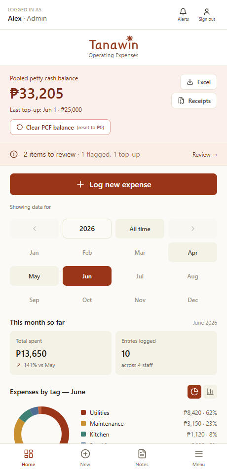
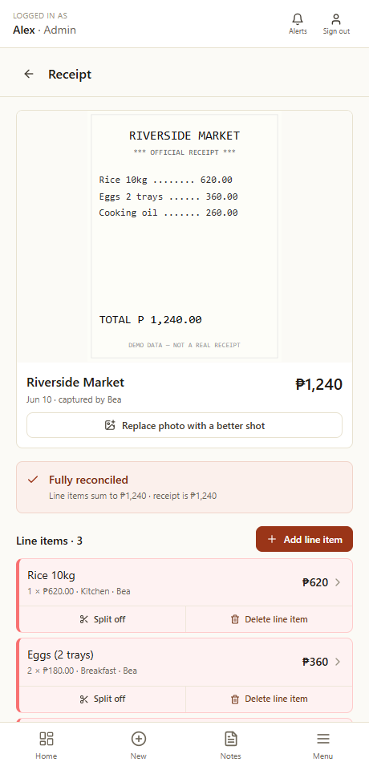
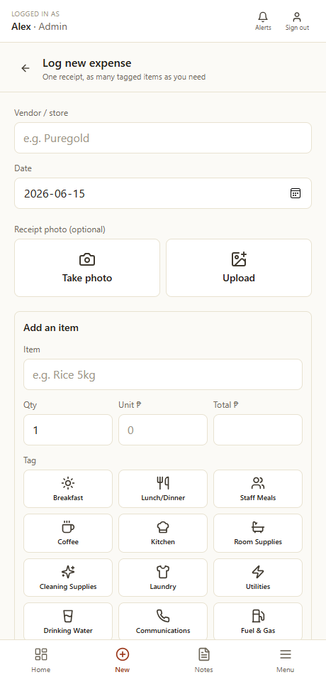
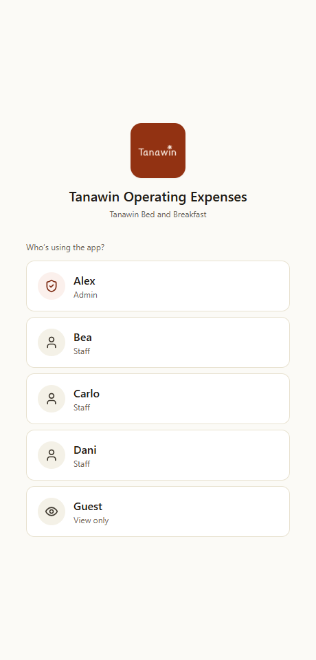
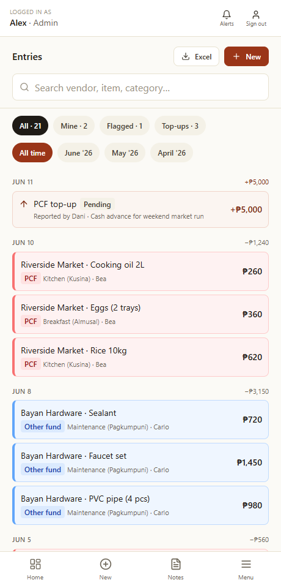
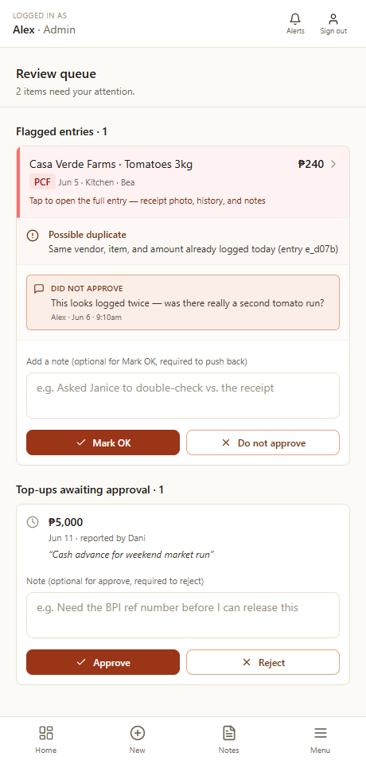

# Tanawin Operating Expenses

A mobile-first expense tracker built for a real bed-and-breakfast in the Philippines. Staff log palengke (market) runs and utility bills from their phones; the owner reviews, approves petty-cash top-ups, reconciles receipts, and hands a clean set of books to the accountant.

> **Note:** All names, vendors, amounts, and receipts in these screenshots are **fictional demo data** — the real business's records are private. See [Demo mode](#demo-mode) to run it yourself.

| Owner dashboard | Receipt reconciliation | Log an expense |
|---|---|---|
|  |  |  |

| Sign-in (role picker) | Expense ledger | Review queue |
|---|---|---|
|  |  |  |

---

## What it does

- **Multi-item purchases** — one receipt photo, many tagged line items, with live reconciliation against the printed total.
- **Pooled petty cash (PCF)** — staff report top-ups, the owner approves or rejects them with a reason, and every expense draws the balance down automatically.
- **Roles** — **Admin** (full control), **Staff** (log and discuss their own entries), and a view-only **Guest** for accountants and family.
- **Review & notifications** — flagged entries (duplicates, arithmetic slips, outliers) and rejected top-ups surface in a review queue and a header notification bell, so nothing waiting on someone gets missed.
- **Receipt tools** — replace a blurry photo, add a missing item to an existing receipt, split or delete line items (with an audit trail), and mark a receipt complete when part of it was a personal, non-PCF purchase.
- **Hand-off** — one-tap Excel export and a downloadable "receipts pack" (ZIP of photos + CSV index) for the bookkeeper.
- **Installs to the home screen** — a Progressive Web App with its own icon, opening full-screen; ~225 KB to start, so login is near-instant.

## Tech stack

Next.js 15 (App Router) · React 18 · TypeScript · Tailwind CSS · Supabase (PostgREST) · deployed on Cloudflare Pages.

## Engineering highlights

The interesting constraints — and how they were solved:

- **No schema changes allowed.** The backend could only be reached through PostgREST with anon/service keys — no DDL, so no new columns, ever. Several features that would normally each want their own column (multiple receipt photos + edit history, an admin recovery-code hash, a view-only role override, a receipt deletion log + "mark complete" override) are instead packed as small JSON blobs into existing text columns, behind a single parse/serialize boundary so the rest of the app stays clean.

- **Saves that can't silently fail.** The store started fully optimistic (instant local update, fire-and-forget write). On flaky hotel Wi-Fi a failed write looked saved and then vanished on refresh — unacceptable for money. Writes now wait for server confirmation, show a "Saving…" state, and on failure keep everything on screen for a one-tap retry.

- **Lazy media.** Receipt photos live as compressed base64 in the database, which had grown the startup download to ~27 MB and made the login screen look broken on slow connections. Bootstrap now fetches every column *except* photos (~225 KB total); images load on demand per page, backed by a session cache that survives tab-refocus refreshes. ~120× faster cold start.

- **Resilient bootstrap.** A dropped request used to leave the app stuck with an empty user list and no retry. It now auto-retries with backoff, retries on the browser's `online` event, and shows an explicit "couldn't connect" state.

- **Self-service account recovery.** The owner can generate a one-time recovery code (only its SHA-256 hash is stored) to reset her own PIN from the login screen if she forgets it — no developer round-trip.

## Demo mode

Set `NEXT_PUBLIC_DEMO=1` to swap the live backend for a self-contained fictional dataset (`lib/demo-data.ts`) — reads serve canned rows, writes succeed locally and persist nowhere. Used for these screenshots and any public demo, so real data never leaves the building.

```bash
npm install
NEXT_PUBLIC_DEMO=1 npm run dev   # http://localhost:3000
```

Append `?demo=staff` or `?demo=guest` to any URL to preview those roles.

## Project layout

- `app/` — routes, grouped by role: `(admin)`, `(staff)`, `(shared)`
- `components/` — shared UI (bottom nav, notification bell, receipt tools, …)
- `lib/` — the heart of it: `store.ts` (state + Supabase), `types.ts`, `validation.ts`, `demo-data.ts`, plus auth, export, and the receipts pack

---

<sub>Screenshots are demo data. Built with Next.js and the Claude Agent SDK.</sub>
